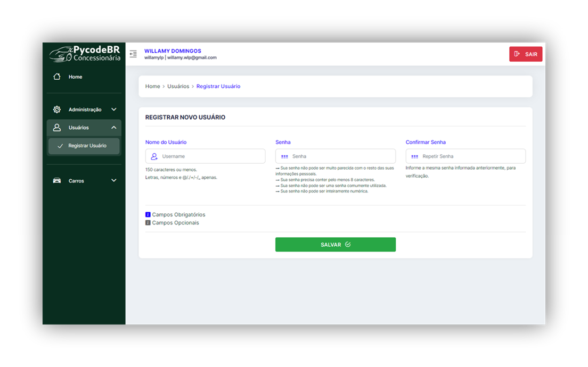

# CARS - PyCodeBR

Projeto de Concessionária de Carros da PycodeBR

## Requisitos

Certifique-se de que você tenha os seguintes requisitos instalados em seu sistema:

- Python (versão recomendada: 3.7 ou superior)
- Django (instalado automaticamente ao seguir as instruções abaixo)
- Outras dependências listadas no arquivo `requirements.txt`


## Instalação das Dependências

Com o ambiente virtual ativado, instale as dependências do projeto usando o comando:
```bash
pip install -r requirements.txt
```


## Rodar o projeto

Após instalar as dependências, aplique as migrations no banco de dados com o comando:
```bash
python manage.py migrate
```

Agora o projeto jã pode ser inicializado com o comando:
```bash
python manage.py runserver
```

Após isso, o sistema estará pronto para ser acessado em:
[http://localhost:8000](http://localhost:8000)

---

## Imagens do Projeto

> ### Formulário de Cadastro e Login
 

> ### Formulário de Cadastro de Usuários pelos Admins
 

> ### Formulário de Cadastro de Novo Carro com Validação
 


> ### Listagem dos Carros Cadastrados


> ### Detalhamento do Carro com Confirmação de _Delete_
 

